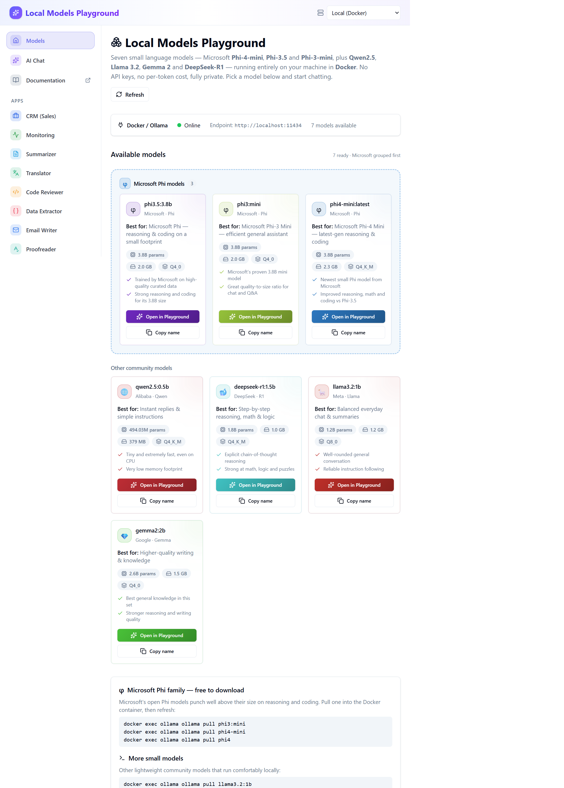
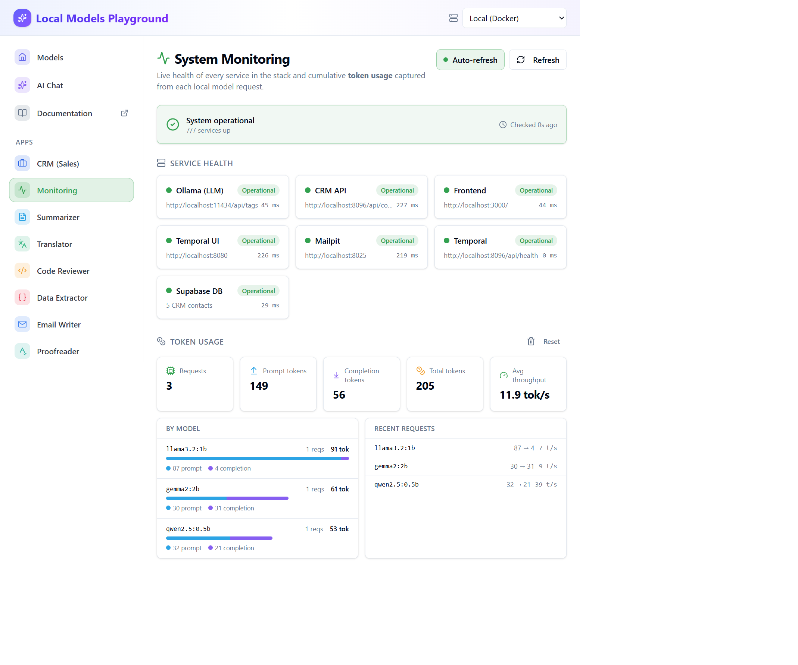

# Boilerplate Stack

Phase 1 scaffolding for the JSON-driven Supabase + Temporal starter.

## Screenshots

A live walkthrough of the running stack (`docker compose up -d`), captured from the deployment at http://localhost:3000.

### Local Models Playground
Small language models served locally in Docker. Models are grouped with the Microsoft Phi family first, each card showing parameters, on-disk size, quantization and "best for" guidance.



### Sales Force Automation CRM
A durable sales pipeline where every lead is a long-running **Temporal** workflow persisted to **Supabase**, with the local language model layered on top for drafting outreach, suggesting the next best action, summarizing deals and qualifying leads (BANT).


### System Monitoring
Live health for every service in the stack (Ollama, CRM API, Frontend, Temporal, Mailpit, Supabase DB) plus cumulative **token usage** captured from each local model request — totals, per-model breakdown and throughput.



### AI Chat
Streaming chat against any locally pulled model, with a model picker, stop control and copy/error states.


## Apps

Once the stack is running, open **http://localhost:3000** and pick an app from the left sidebar. Every app runs against the local models — no API keys, no per-token cost, fully private.

### Core

| App | Route | What it does |
| --- | --- | --- |
| **Local Models Playground** | `/` | Gallery of every model installed locally — parameters, on-disk size, quantization and "best for" guidance, grouped with Microsoft Phi first. |
| **AI Chat** | `/chat` | Streaming chat against any installed model, with a model picker, stop control, and copy/error states. |

### Text & code tools

| App | Route | What it does |
| --- | --- | --- |
| **Summarizer** | `/apps/summarizer` | Condense long text into clear bullet points. |
| **Translator** | `/apps/translator` | Translate text into another language. |
| **Code Reviewer** | `/apps/code-reviewer` | Review code for bugs, edge cases, security issues and improvements. |
| **Data Extractor** | `/apps/extractor` | Turn unstructured text (emails, invoices, notes) into structured JSON. |
| **Email Writer** | `/apps/email-writer` | Turn a few notes into a polished email. |
| **Proofreader** | `/apps/proofreader` | Fix grammar, spelling and punctuation. |
| **Tone Rewriter** | `/apps/rewriter` | Rewrite text in a different tone or style. |
| **Brainstormer** | `/apps/brainstorm` | Generate fresh ideas around any topic. |
| **Explainer** | `/apps/explain` | Explain any concept at the level you choose. |
| **SQL Generator** | `/apps/sql` | Turn a plain-English request into a SQL query. |
| **JSON Builder** | `/apps/json-builder` | Describe the data you need and get well-formed JSON. |
| **Azure Architecture Advisor** | `/apps/azure-architecture` | Assess a workload through the Azure Well-Architected Framework. |
| **Polymarket Analyst** | `/apps/polymarket` | Estimate market odds for a real-world event (research only — not financial advice). |
| **Kalshi Analyst** | `/apps/kalshi` | Turn an event question into a Kalshi-style YES/NO contract (research only — not financial advice). |

### Full-stack apps (Temporal + Supabase)

| App | Route | What it does |
| --- | --- | --- |
| **CRM (Sales Force Automation)** | `/apps/crm` | A durable sales pipeline where each lead is a long-running **Temporal** workflow persisted to **Supabase**, with the local model layered on top for outreach drafting, next-best-action, deal summaries and BANT qualification. |
| **System Monitoring** | `/apps/monitor` | Live health for every service (Ollama, CRM API, Frontend, Temporal, Mailpit, Supabase DB) plus cumulative **token usage** captured from every model request, broken down per model. |

## How to use

### Text & code tools
1. Open the app from the left sidebar.
2. Choose a model from the **model dropdown** (defaults to `qwen2.5:0.5b`; larger Phi/Gemma/Llama models give stronger results).
3. Paste or type your input in the left panel.
4. Click the action button (e.g. **Summarize**, **Translate**, **Review**) — the response streams in on the right.
5. Use **Stop** to cancel, **Copy** to grab the output, then tweak the input and re-run.

### CRM (full-stack)
1. Open **CRM (Sales)**. The CRM API (`crm-web`), Temporal and Supabase start automatically with `docker compose up -d`.
2. Add a lead in **New lead** → this starts a durable `CrmLeadWorkflow` in Temporal, persisted to Supabase.
3. Click a lead to open it, then drive the pipeline with **Advance / Mark won / Disqualify** (these are Temporal signals) — `New → Contacted → Qualified → Proposal → Won`.
4. Use the **AI assistant** (Draft outreach email, Next best action, Summarize deal, Qualify BANT) and **Save to timeline** to write the result back to the lead's durable history.

### System Monitoring
1. Open **Monitoring** to see every service's status and latency; toggle **Auto-refresh** for 10s polling.
2. **Token usage** accrues automatically as you use any app — totals, per-model prompt/completion split and throughput. Use **Reset** to clear local counters.

## Prerequisites
- Docker Desktop with Compose v2
- `make` (comes with macOS/Linux; install via Xcode CLT on macOS)
- Node 18+ (optional for running the frontend outside Docker)
- Supabase CLI (optional) if you want the full Supabase stack locally

## Quick Start
1) Copy environment defaults  
   `cp .env.example .env`
2) Start everything  
   `make up`  
   (add `USE_DEV=1` for live-reload mounts)
3) Open services  
   - Frontend placeholder: http://localhost:3000  
   - Temporal UI: http://localhost:8080  
   - Temporal gRPC: localhost:7234  
   - Supabase Postgres stub: localhost:55432

Common commands:
- `make down` — stop containers
- `make reset` — tear down volumes and recreate containers
- `make logs` — stream all service logs
- `make logs-temporal` / `make logs-frontend` — targeted logs

## Local & Cloud SLM (Ollama)
A GPT‑style small language model runs locally in Docker and can be deployed to Azure.
- **Server:** `ollama` service on http://localhost:11434 (default model `qwen2.5:0.5b`; also `llama3.2:1b`, `gemma2:2b`)
- **Showcase UI:** http://localhost:8090/slm.html — live streaming demo with endpoint + model dropdowns
- **Cloud:** Bicep IaC under `infra/azure/` deploys Ollama to Azure Container Instances

Quick start:
```bash
docker compose up -d ollama ollama-pull   # start server + pull default model
```
See [docs/SLM.md](docs/SLM.md) for full architecture, model management, Azure deployment, API reference, and troubleshooting.
For a step‑by‑step local + Azure deployment walkthrough, see [docs/DEPLOYMENT.md](docs/DEPLOYMENT.md).

## What’s Included (Phase 1)
- Docker Compose stack with Temporal server, UI, worker, frontend dev server, and stub Supabase Postgres
- Development overrides in `docker-compose.dev.yml` for live-reloading frontend and worker code
- Makefile wrappers for the usual lifecycle commands
- `.env.example` capturing required variables for frontend, Temporal, and Supabase placeholders

## Notes
- Supabase services are intentionally stubbed for Phase 1; use `supabase start --config supabase/config.toml` when you need the full Supabase stack.
- Frontend and Temporal code are minimal placeholders to keep containers healthy; replace with real implementations in Phases 2–3.
