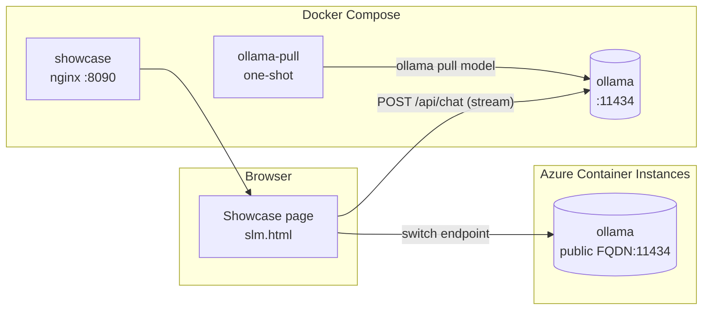

# Local & Cloud SLM Stack (Ollama)

This document describes the **Small Language Model (SLM)** capability added to the
stack: a GPT‑style model served by [Ollama](https://ollama.com) that runs locally
in Docker and can be deployed to **Azure Container Instances (ACI)**, plus an
interactive **showcase page** for trying it out.

---

## Table of contents
- [Overview](#overview)
- [Architecture](#architecture)
- [Models](#models)
- [Running locally (Docker)](#running-locally-docker)
- [The showcase page](#the-showcase-page)
- [Deploying to Azure (ACI)](#deploying-to-azure-aci)
- [API reference](#api-reference)
- [Configuration](#configuration)
- [Troubleshooting](#troubleshooting)

---

## Overview

| Capability | Detail |
|------------|--------|
| Runtime | `ollama/ollama:latest` |
| Default model | `qwen2.5:0.5b` (~0.5B params, 397 MB, CPU inference) |
| Extra local models | `llama3.2:1b`, `gemma2:2b` |
| Local endpoint | `http://localhost:11434` |
| Cloud target | Azure Container Instances (public FQDN, port 11434) |
| Showcase UI | `http://localhost:8090/slm.html` |
| Cost / privacy | No API keys, no per‑token cost; runs fully offline on CPU |

The SLM powers in‑app assistance, summarization, classification/routing,
structured extraction, and draft generation — all without sending data to a
third‑party provider.

---

## Architecture



Request flow for a generation:

```
Browser → HTTP POST /api/chat → Ollama :11434 → loads model → streams NDJSON → onToken()
```

Ollama returns **newline‑delimited JSON** when `stream: true`; the client parses
each line and emits incremental tokens.

---

## Models

| Model | Params | Size | Notes |
|-------|--------|------|-------|
| `qwen2.5:0.5b` | ~0.5B | 397 MB | Default; fastest, lightest |
| `llama3.2:1b` | ~1B | 1.3 GB | Better quality, still fast on CPU |
| `gemma2:2b` | ~2B | 1.6 GB | Highest quality of the three |

Pull additional models into the local container:

```powershell
docker exec ollama ollama pull <model>      # e.g. phi3:mini, qwen2.5:1.5b
docker exec ollama ollama list              # list installed models
```

---

## Running locally (Docker)

The `ollama` service and a one‑shot `ollama-pull` (which downloads the default
model) are defined in `docker-compose.yml`.

```powershell
# Start the model server + pull the default model
docker compose up -d ollama ollama-pull

# Verify the model is available
docker exec ollama ollama list

# Smoke test the API
$body = @{ model = "qwen2.5:0.5b"; prompt = "Say hello"; stream = $false } | ConvertTo-Json
(Invoke-RestMethod -Uri "http://localhost:11434/api/generate" -Method Post -Body $body -ContentType "application/json").response
```

Relevant compose excerpt:

```yaml
ollama:
  image: ollama/ollama:latest
  environment:
    - OLLAMA_ORIGINS=*          # allow the browser to call the API (dev only)
  ports:
    - "11434:11434"
  volumes:
    - ollama-data:/root/.ollama # persist downloaded weights

ollama-pull:                    # one-shot: pull the model, then exit
  image: ollama/ollama:latest
  depends_on: [ollama]
  environment:
    - OLLAMA_HOST=ollama:11434
  entrypoint: ["/bin/sh", "-c", "sleep 5 && ollama pull qwen2.5:0.5b"]
  restart: "no"
```

---

## The showcase page

A static page served by nginx (`showcase/` container) at
**http://localhost:8090/slm.html**. It provides:

- **Endpoint dropdown** — switch between **Local** (`localhost:11434`) and
  **Azure ACI**. Health and model list refresh on change.
- **Model dropdown** — `gemma2:2b`, `llama3.2:1b`, `qwen2.5:0.5b`; also
  re‑populated dynamically from the selected endpoint's `/api/tags`.
- **Live streaming demo** — type a prompt, click *Generate*, watch tokens stream
  in with timing.
- **Use cases** and **technical internals** (architecture, endpoints, compose +
  client code).

Rebuild after editing the page:

```powershell
docker compose build --no-cache showcase
docker compose up -d --force-recreate showcase
```

---

## Deploying to Azure (ACI)

Infrastructure is defined as **Bicep** under `infra/azure/`:

- `main.bicep` — an ACI container group running Ollama with a public FQDN,
  port 11434, `OLLAMA_ORIGINS=*`, and a startup command that serves the API and
  pulls the model.
- `main.bicepparam` — parameters (location, model, CPU/memory).

Deploy:

```powershell
az group create --name rg-slm-ollama --location canadaeast
cd infra/azure
az deployment group create `
  --resource-group rg-slm-ollama `
  --template-file main.bicep `
  --parameters main.bicepparam `
  --query "properties.outputs"
```

The deployment outputs the public `fqdn`, `ollamaUrl`, and `publicIp`. The
container re‑pulls the model on startup, so it self‑heals after restarts.

Tear down to stop billing:

```powershell
az group delete --name rg-slm-ollama --yes --no-wait
```

> **Note on persistence:** ACI's Azure Files volume mount requires storage
> *account‑key* access. On subscriptions where org policy enforces
> `allowSharedKeyAccess = false`, persistent volumes are not possible — the
> template instead re‑pulls the model on startup. See the comment in
> `infra/azure/main.bicep`.

> **Security:** the ACI endpoint is **public, unauthenticated HTTP** — suitable
> for demos only. For production, front it with HTTPS + auth (API Management or
> App Gateway) and restrict `OLLAMA_ORIGINS`.

---

## API reference

Ollama exposes a simple REST API (default port `11434`):

| Method & path | Purpose |
|---------------|---------|
| `POST /api/chat` | Streaming chat completions (messages array) |
| `POST /api/generate` | Single‑prompt completion |
| `GET  /api/tags` | List installed models |
| `POST /api/pull` | Download a new model |

Streaming client (`frontend/src/data/ollama.ts`):

```ts
const res = await fetch(`${OLLAMA_URL}/api/chat`, {
  method: 'POST',
  headers: { 'Content-Type': 'application/json' },
  body: JSON.stringify({ model, messages, stream: true }),
});

// Ollama returns newline-delimited JSON; read it chunk by chunk:
const reader = res.body.getReader();
const decoder = new TextDecoder();
// for each line -> JSON.parse -> onToken(json.message.content)
```

---

## Configuration

| Variable | Default | Used by |
|----------|---------|---------|
| `VITE_OLLAMA_URL` | `http://localhost:11434` | Frontend client |
| `VITE_OLLAMA_MODEL` | `qwen2.5:0.5b` | Frontend client |
| `OLLAMA_ORIGINS` | `*` | Ollama server (CORS) |
| `OLLAMA_HOST` | `0.0.0.0:11434` | Ollama server bind |

---

## Troubleshooting

| Symptom | Fix |
|---------|-----|
| `Ollama unreachable on :11434` | `docker compose up -d ollama` and wait a few seconds |
| Model not listed | `docker exec ollama ollama pull <model>` |
| Showcase shows stale content | `docker compose build --no-cache showcase && docker compose up -d --force-recreate showcase` |
| Azure deploy `CannotAccessStorageAccount (403)` | Org policy disables shared‑key access; the template omits Azure Files and re‑pulls on startup |
| Browser CORS error | Ensure `OLLAMA_ORIGINS=*` (dev) and that the page and endpoint use the same scheme (both HTTP) |
